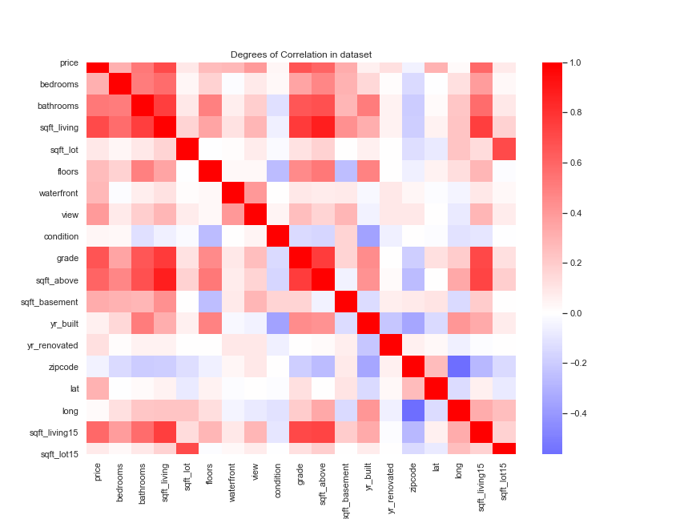

# Kings County Housing Bake-off
---
This project conducts an analysis on the Seattle, Washington, Kings County Houses attributes data to create a model that will make the best prediction of the price of a house. House prices depend on a lot of factors like the house characteristics, economic environment, housing market, neighborhood, neighboring houses, proximity to amenities etc. According to an article on [Opendoor](https://www.opendoor.com/w/blog/factors-that-influence-home-value) the depending variables can be boiled down to eight critical factors; neighborhood comps, location, home size and usable space, age and condition, upgrades and updates, local market, economic indicators and interest rates.The project will use intuition, statistics and python to build the model.

## Data
The data used in this project is based on the following 21 key descriptions of houses sold in Kings County of Seattle, Washington.

* **id** - unique ID for a house
* **date** - Date day house was sold
* **price** - Price is the prediction target
* **bedrooms** - Number of bedrooms
* **bathrooms** - Number of bathrooms
* **sqft_living** - square footage of the home
* **sqft_lot** - square footage of the lot
* **floors** - Total floors (levels) in house
* **waterfront** - Whether house has a view to a waterfront
* **view** - Number of times house has been viewed
* **condition** - How good the condition is (overall)
* **grade** - overall grade given to the housing unit, based on King County grading system
* **sqft_above** - square footage of house (apart from basement)
* **sqft_basement** - square footage of the basement
* **yr_built** - Year when house was built
* **yr_renovated** - Year when house was renovated
* **zipcode** - zip code in which house is located
* **lat** - Latitude coordinate
* **long** - Longitude coordinate
* **sqft_living15** - The square footage of interior housing living space for the nearest 15 neighbors
* **sqft_lot15** - The square footage of the land lots of the nearest 15 neighbors

The training dataset on which the model will be built has information on 17290 houses in the Kings County.
Here is a heatmap visualization, that tells you the degree of correlation between the variables. The darker the red the stronger the relationship and darker the blue the lesser the relationship. A strong correlation between the features and the target variable price is good while a strong relationship of one feature with another is not.

## Method

The model building process will follow the steps below:
* 1. Exploratory Analysis: Understanding the data before model creation is important. Exploratory Data Analysis or EDA is done by looking at the distribution of data for each of the variables, checking the kind of values present in the dataset. Identifying any variable relationship is also performed here. Much can be learned by also performing descriptive analysis on the data.

* 2. Data Cleaning: Any issues spotted during the EDA process is addressed at this step. Issues like missing values, changing data types etc

* 3. Feature Engineering: The independent variables can be used to build new features that can explain the target variable better and help in builing better models. Feature Engineering can be achieved by manually creating features based on intuition or through automated processes using sklearn.

* 4. Train-Test Split: Train-Test Split is an important step which will reduce the risk of overfitting the model to the dataset. By splitting it to a train and test test, the models can be built using the train set and applied to the test set to predict and test the model strength.

* 5. Feature Selection: While running models, selecting features is an important aspect that differentiates one model from the other. Feature Selection can be achieved by manaual excluding or including features, as well as using various feature selection option like the filter method, wrapper method or the Embedded Method.

* 6. Model Evaluation: Model evaluation can be done on the bases of the magnitude of the Root Mean Squared Error. The smaller the RMSE, the better the model

* 7. Final Model: The final model will be used to predict the target variable or house prices on the hold out data.

## Results
Four models were created selecting various feature subsets. The RMSE scores from the test predictions for each of the models were

* Baseline Model:      159552.8676594423 
* Log Baseline Model:  655070.6539820895 
* Manual Feat Model:   195675.7106643109 
* KBest Model:         189733.51207795765 
* **RFE :                158484.35982955483**

## Conclusion
Based on the results, the RFE or Recursive Feature Elimination model performed the best with the least RMSE score.

## For more Information
---
You can view the full analysis in for this project in the [Jupyter Notebook](Bakeoff_modeling_process.ipynb)

## Repository Structure
---

* ├── Bakeoff_modeling_process.ipynb : Project analysis explained with documentation
* ├── Predict_holdout.ipynb : Project prediction process with final model
* ├── README.md : README with project summary for reviewere
* ├── housing_preds_Lhamu.csv : Project predictions on holdout set 
* ├── kc_house_data_test_features.csv: Project holdout data set on which prediction were made
* ├── model.pickle : Python pickled object referencing the final model
* ├── model_features.pickle : Python pickled object referencing the final model selected features
* ├── images : saved images from the project

